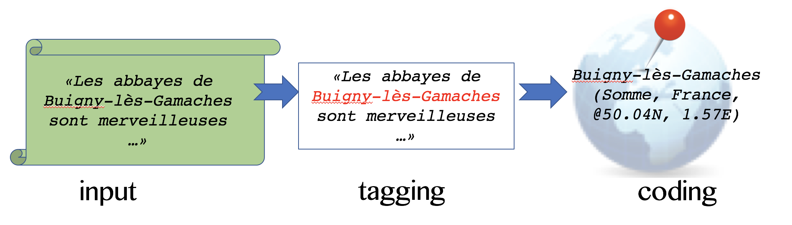

Geocoder's Handbook for Xponents
================================
Author: Marc Ubaldino
Copyright OpenSextant.org, 2017

Welcome to Xponents.  We realize geocoding text or data can be tedious and mind numbing.
Hopefully this handbook will help you walk through the techniques defined in Xponents
and the rest of OpenSextant in a way that makes it obvious which rules will impact 
your geocoding of your data.

There main topics to cover (Figure 1):

* input -- you should understand your input text.
* tagging -- first finding geographic mentions and supporting infomation in data
* coding -- parsing and justifying the location of a mention as precise as is appropriate.



In either topic we will encounter the concept of **filters** that either negate or promote a finding.
And lastly **evidence** is any metadata that can be attached to a geotag or geocode to further back 
the choice of a location.   ```Look for pointers on Xponents solutions, aka Java classes, in each topic```

The primary implementation for this handbook is the Java package ```org.opensextant.extractors.geo```. 
The design of this package provides some good terminology to understand the methodolgy here:

* **Text Match:**  any tag found by Xponents Extractor or Patterns implementations
* **Place Candidate:** a tag representing a name, abbreviation, or code that matches something in the gazetteer
* **Place:** an named location, i.e., a place candidate has multiple places where the name appears.  
E.g., "Lebanon" is a country and name of towns around the world.  This is a straight representation of a 
gazetteer entry.
* **Scored Place:** a sub-class of place attached to a candidate. A scored place carries additional 
metadata such as a score, related to the geocoding workflow.

Tagging Conventions
===================
* **T1. Language of text, etc.** You should know the language and original character set of your text. 
Language ID helps direct tagging and filtering parts of speech found in texts, using such things as
word stemming, tokenization, treatment of diacritics and stopword filtering.  Xponents provides ```TextInput```
class to carry basic metadata like lang ID and a Unicode text buffer, however language detection must be done 
externally as this differs based on the type and length of text.  
* **T2. Coordinates or other hard location references.** Coordinates are typically used in geological, maritime, 
military, transportation, humanitarian and other industries. They offer excellent context to ground other
names or allusions to the geography at hand.  In Xponents, coordinate can be queried against the ```SolrGazetteer.placesAt()```
method to reveal nearest cities, the province and country containing the location, or the fact the coordinate is
not near anything (e.g., over water). **Xponents Patterns** project has ```XCoord``` extractor which detects and geocodes
the coordinate patterns listed here in the [XCoord Patterns reference manual](XCoord_Patterns.htm) reference manual.
* **T3. Names of populated places and administrative &amp; geopolitical boundaries.**
Any known geographic name can be tagged in any language (Xponents does not currently support the use of 
statistical models that can tag unknown names based on a learned model). **[SolrTextTagger](https://github.com/OpenSextant/SolrTextTagger/)**
is used along with Solr 4.x or 6.x to tag all known names, where the known geo-names are curated by the
 ```GazetteerMatcher``` class exposes the SolrTextTagger capability indirectly through calling a Solr request. 
The **[Gazetteer](https://github.com/OpenSextant/Gazetteer/)** is the primary source of consolidated gazetteer
data.
* **T4. Abbreviations, Aliases and Codes** are often overlooked in geotagging, but are incredibly helpful
in things such as detecting and qualifying business addresses, by line locations in news articles, and informal speak
such as the use of nicknames for cities. The solutions discussed above in convention **T3** are the same for tagging, 
however this class of tag is filtered and used differently than proper names. 
* **T5. Geopolitical and geographic context** such as nationalities.  Xponents maintains a list of nationalities
that infer a country code. There are certainly singular ethnicities within multiple countries that are not 
represented. A future enhancement would be to provide the mapping for such multiplicity.
* **T6. Non-Place entities** such as organizations and well-known persons. Identifying things that are 
likely not places helps filter out noise or amplify context.  For example, ```Detroit City Council`` is an 
organization name, that contains a city name. Whereas the ```Smithfield Group``` may be an institution not actually located
in a place called ```Smithfield```.  Either way it is important to be able to detect all such cases to work
with negation or amplification all at once. Xponents **Extraction** project provides ```TaxonMatcher```, aka XTax, which 
provisions a lexicon of such "well-known" non-places of your choosing or the default set used by Xponents.
* **T7. Time Zones** can be used to infer a general source of information and provide additional context. 
Xponents **Basiscs** has a ```Country``` class that makes use of a timezone table (source: Geonames.org) which 
helps infer one or more country codes for a given timezone.  Xponents **Patterns** ```XTemporal``` extractor can be used
to detect and code dates and times, if a date/time/timezone is not already provided.  The important part 
here is to recognize the **innate time and timezone in the original data**, not the UTC time. 

Geo-inferencing and Geocoding Rules 
===================
Rules are organized and fired by some main program, the reference implementation here is ```PlaceGeocoder``` in 
Xponents **Extraction** project.  Some rules are fired generically in order, while others are fired separately.
All rules (of type ```GeocodeRule```) are evaluated (```evaluate()```) after the tagging has occurred. Tagging
yields a list of ```PlaceCandidates``` which may have been filtered by the tagging phase.  Each candidate may
also have heuristics about the text, including if the text is all upper case, all lower case, pure ASCII vs. 
diacritic or non-ASCII.   As rules fire they contribute a rule label, a score increment and/or additional evidence
to each candidate.  

A final rule, a **Location Chooser**, assesses given evidence, context, rules and scores for each candidate. 
Ultimately the best score wins and a confidence (100 point scale) is associated with the choice to make it 
easier to compare geotagging and geocoding confidence across documents and data sets.

* **R1. Country Mentions (CountryRule).** Detect an mention of the name or reference of a country. Explicit 
mentions by name or abbreviation emit a country code (rule+score increment).  Nationalities add to context, 
but do not actually emit a country code.  Only select country codes seen in text might act as an explicit mention, 
e.g., "US", "JPN" or "CHN" (all caps) emit country mentions, however "COL" (Colombia) does not as it can easily
be confused with other abbreviations such as "colonel".
* **R2. Name, CODE Pattern (NameCodeRule).** Detect two candiates following each other where one is any 
place name followed by a CODE or name of an adminstrative boundary.  Example ```San Fran, CA``` 
* **R3. Names in general (NameRule).**  Use a limited set of qualifying phrases to increment the score of 
matching candidates. Specifically (in English currently) ```town of```, ```city of```, etc. preceeding the name
of populated places (feature types ```P/PPL```) score those candidates higher.  As well, ```province``` 
preceeding or following a name scores higher candidates that are Level-1 administrative boundaries. 
Could be enhanced by having table-driven rules per language.
* **R4. Coordinate Reverse-geocoding (CoordinateAssociationRule).** IFF coordinates are detected (or provided
some other means) those locations infer a particular containing province and country for each coordinate. Relevant
provinces provide context that scores higher other place candidates in those provinces.  ```SolrGazetteer.placesAt```
provides a simple recursive reverse lookup of location to containing boundaries or nearby places.  First 10 KM, then
30 KM radii are tried looking for closest match.
* **R5. Province Mentions (ProvinceAssociationRule).** Using any explicit administrative boundaries found,
loop over all candidates and increment score of any other candidates found to be contained geographically within 
those boundaries. The solution uses a the hierarchy of geographic names coding, e.g., ```COUNTRY.ADM1.ADM2```
is known as a hiearchical tree that represents containment of boundaries in a lexical string.  So, ``USA.06.4221``
is county (district) # 4221 in "California"(06) "USA".  A city in that district will have the same hiearchical coding, 
whereas a city of the same name in a different country would not. 
* **R6. Person Names (PersonNameFilter).**  Accounts for any qualified person (and organization) name patterns to negate (```filter out```)
tagged place names.  Specific rules such as R2. Name, CODE run ahead of this rule to ensure situations such
as "Eugene, OR" are not filtered out as person name (i.e., "Eugene") becuase it is a well-qualified place mention.
* **R7. Nonsense (NonsenseFilter).** Detect and filter out trivial matches that fall into a few categories: 
short phrases with diacritics (e.g., matching country codes or other abbreviations), numeric patterns in names, 
out of place punctuation, repeated short phrases ("boo boo"), obscure mixed case or lower case.  The effect
is to mark matching candidates as ```filtered out```
* **R8. Major Place Mentions (MajorPlaceRule).** Use population stats (source: geonames.org cities15000) 
to amplify score of populated place or administrative boundary matches.
* **R9. Place mentioned in Organization (ContextualOrganizationRule).**  Seek to reverse a ruling
that a candiate was filtered out because it was an organization name.  If a relevant province is inferred
so far, and the candidate has a location in that province, then score that location higher.
* **R10. Location Choosing (LocationChooserRule).**
  * Assess non-filtered out candidates
  * Choose the highest scoring location for each candidate
  * Assign confidence to each choice based on document scoped evidence as well as those rules attached to the particular mention


  
