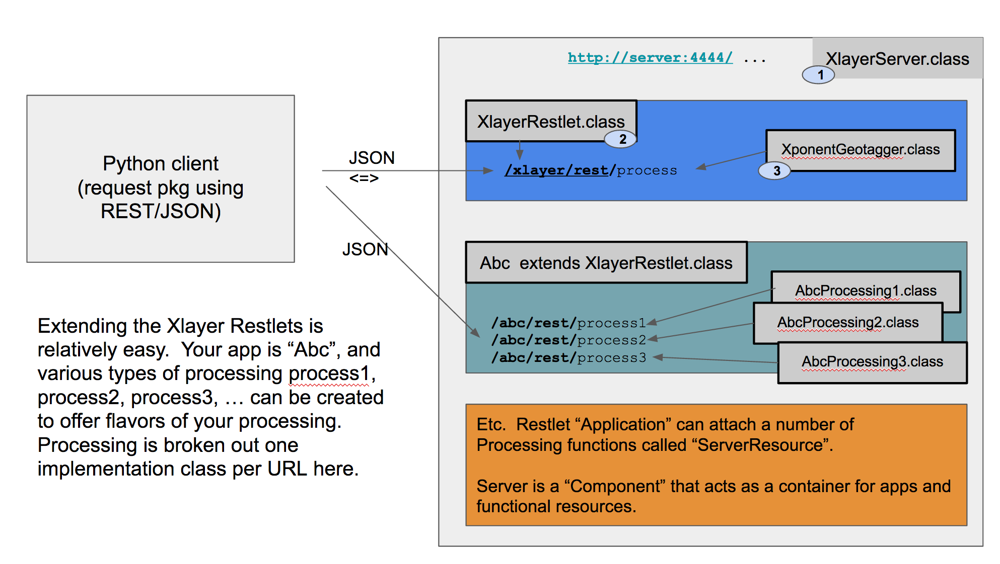

Xlayer:  Xponents REST service
==============================

You can pronounce this like "Zlayer" or X-Layer or Slayer.
Using primarily the Restlet Framework (http://restlet.org)
we have a very basic ability to provision the Xponent extraction 
as REST services.   

In this package is a REST server and several test clients in Java and Python 
which demonstrate how to call the extraction service and parse the results.

History 
---------
* version 0.8
  * Xponents 3.1.0, exposing reverse geocoding feature set
  
* version 0.6
  * Xponents 3.0 release integrated

* version 0.2
  * added features and options to allow caller to customize request
  * Expose PlaceGeocoder capability: geocode text, yielding 
    places, coordinates, countries, and matched non-places organizations and person names


Execution
--------------

This is a server-side capability, but you can write your own BAT, Groovy, Ant or other script
to invoke the main Restlet server as shown in this script:

    ./script/xlayer-server.sh  start 8080
    .... 
    ./script/xlayer-server.sh  stop 8080 

For now the script takes a port number, running a HTTP server on that port, with no security.
And then also the control command start or stop.  Now the server is running, access it at:

    http://localhost:8080/xlayer/rest/process ? docid = .... & text = ...

GET or POST operations are supported.  With GET, use the parameters as noted above.
With POST, use JSON to formulate your input as a single JSON object, e.g., `{"docid":..., "text":....}`
Additionally, features and tuning parameters will be supported.

Testing/Processing
------------------

A quick test can be done by these test scripts: In each case specify the PORT that Xlayer is running on and then 
test file.

* `./test/test-xlayer-curl.sh PORT FILE`  - requires cURL
* `./test/test-xlayer-java.sh PORT FILE`  - requires Java and test libraries in ./lib
* `./test/test-xlayer-python.sh PORT FILE`  - requires Python 2 `opensextant` module in `PYTHONPATH`

Developing with Java
-------------------

Pardon the paltry API documentation. Still polishing.

Use the `opensextant-xponents` artifact and `org.opensextant.xlayer.XlayerClient(url)` 
gives you a starting point to invoke the `.process()` method. [API](../doc/sdk-apidocs/org/opensextant/xlayer/XlayerClient.html). 

```java
/* Note - import org.opensextant.output.Transforms is handling the JSON-to-Java 
 * object deserialization if for whatever reason that is wrong, you can adapt it as needed.  
 */
....

client = XlayerClient(url);
results = client.process(....);
/* Results is an array of TextMatch */

```

Developing with Python
--------------------
In your distribution use either `./python/opensextant-1.*.tar.gz` of from a checkout, 
compose the Pip bundle as `cd ./python/;  python ./setup.py sdist`.  The resulting TAR/gz file will be in `./dist`. 

Install it, `pip3  install opensextant-1.2.tar.gz`.  You now can make use of the `xlayer` module, as documented 
here in the [Py API](../doc/pydoc/opensextant.xlayer.html). This example captures the meat of it all:

```python

from opensextant.xlayer import XlayerClient
client = XlayerClient(url)
result  = client.process(.....)

# result is a simple array of dict.
# Later versions may have a convenience method that transforms raw dictionaries into API classes
# opensextant.Data python classes are not complete and consistent with their Java counterparts.

```

Health Check
--------------

    curl "http://localhost:8080/xlayer/rest/control/ping"

Stopping Cleanly
------------------

    curl "http://localhost:8080/xlayer/rest/control/stop"


REST Interface
---------------
For example,  run the Python client to see how easy it is to call the service above.
Please note a Java version, XLayerClient, also exists in the src/main folder, with
test code in src/test


INPUT:

* `docid` - an optional identifier for this text
* `text`  - UTF-8 text buffer
* `features` - comma-separated string of features which will vary by app.  XponentsGeotagger (default app) class supports: 
   * `places, coordinates, countries` or `geo` to refer to all of those geographic entities
   * `patterns` - configured patterns. By default only date/time patterns are detected and normalized.  As other patterns are implemented, 
     this same REST API could be used without changing the call mechanisms -- your client would have to navigate the additional results though.
   * `persons`, `orgs`, `taxons` to refer to those non-geo entities.  
   * `filtered_out` will turn on noisy entities that were filtered out for some reason. The default is not return filtered-out items.
   
* `options`  - comma-separated string of options
   * Options will vary by app.   XponentsGeotagger class supports: `lowercase`
    
OUTPUT:

* `response`     - status, numfound
* `annotations`  - an array  of objects. 

Annotation schema
 
* `matchtext`      - text span matched
* `type`           - type of annotation, one of `place`, `country`, `coordinate`, `org`, `person`
* `offset`         - character offset into text buffer where text span starts
* `length`         - length of text span.  end offset = offset + length
* `method`         - method tag identifying the means by which this annotation was derived.
* `filtered-out`   - true or false if match was filtered by some rule or configuration setting. 
                   Filtered out items are therefore low-quality stuff.

Geographic annotations additionally have:

* `cc`             - country code
* `lat, lon`       - WGS84 latitude, longitude
* `prec`           - precision inferred from text (coordinate digits) or gazetteer feature type
* `adm1`           - ADM1 boundary code, ideally ISO nomenclature, but still often FIPS
* `feat_class`     - Geonames class. One of A, P, H, R, T, S, L, V.  
* `feat_code`      - Geonames designation code. This is more specific than the class.
* `confidence`     - A relative level of confidence.  Subject to change; A scale of 0 to 100, where confidence < 20 is not reliable or lacks evidence.
* `related_place_name` - IF a close by city can be associated with this coordinate the other metadata
  for ADM1, province name, and country code should reflect the coding. This place name identifies that city.
* `nearest_places` - An ARRAY of all such known places that could be landmarks, natural features, etc.
This is different than the `related_place_name` mainly by feature type: that field is a populated place (P/PPL) and this array is any feature type.

Non-Geographic annotations have:

* `catalog`        - attribution to a data source or catalog containing the reference data
* `taxon`          - the ID of a normalized catalog entry for the match, e.g., `person = { text:"Rick Springfield", taxon:"person.Richard Springfield", catalog:"Rock-Legends"}`


Example JSON Output:
--------------------

```
   from opensextant.xlayer import XlayerClient

   xtractor = XlayerClient(serverURL)

   # Python call -- Send the text, process the text, print the JSON response to console.
   xtractor.process("test doc#1",
     "Where is 56:08:45N, 117:33:12W?  Is it near Lisbon or closer to Saskatchewan?"
     + "Seriously, what part of Canada would you visit to see the new prime minister discus our border?"
     + "Do you think Hillary Clinton or former President Clinton have opinions on our Northern Border?")

   # NOTE -- This is draft 0.1;  We can certainly make a more complete Client API using our own 
   # python or Java data model and API.  This demo client demonstrates primarily the connectivity.
```
 
	 {
	  "response": {
	    "status": "ok",
	    "numfound": 6
	  }
	  "annotations": [
	    {
	      /* A COORD 
	       * ~~~~~~~~~~~~~~~~~~~
	       */
	      /* common annotation items */
	      "text": " 56:08:45N, 117:33:12W",
	      "type": "coordinate",
	      "method": "DMS-01a",
	      "length": 22,
	      "offset": 8,      
	      /*  annotation-specific items: */
	      "cc": "CA",
	      "lon": -117.55333,
	      "prec": 15,
	      "feat_code": "COORD",
	      "lat": 56.145835,
	      "adm1": "01",
	      "feat_class": "S", 
	      "filtered-out":false	      
	    },
	    {
	      /* A COORD, with an indication of neighboring locales.
	       *   option "revgeo" or "resolve_localities" will evoke this output for Coordinates.
	       * ~~~~~~~~~~~~~~~~~~~
	       */
	      /* common annotation items */
	      "text": " 56:08:45N, 117:33:12W",
	      "type": "coordinate",
	      "method": "DMS-01a",
	      "length": 22,
	      "offset": 8,      
	      /*  annotation-specific items: */
	      "cc": "CA",
	      "lat": 56.145835,
	      "lon": -117.55333,
	      "prec": 15,
	      "feat_class": "S", 
	      "feat_code": "COORD",
	      "adm1": "01",
	      "filtered-out":false, 
	      "related_place_name": "Grimshaw",
	      "nearest_places": [
	         {
		      "name": "Provincial Park of Alberta", 
		      "cc": "CA",
		      "adm1": "01",
		      "lat": 56.16,
		      "lon": -117.54,
		      "feat_class": "S", 
		      "feat_code": "PARK",
		      "prec": 5000,             /* Precision (in meters) is an approximate radius around the point
		                                 * that represents the total area of the feature.
		                                 */
	          "distance": 3400	          /* Distance (in meters) from this nearby place to the found coordinate
	                                      */
	         }
	         /* UP to 5 different locations */
	      ]	      
	    },
	    
	    {
	      /* A PERSON 
	       * ~~~~~~~~~~~~~~~~~~~
	       */
	      "text": "Hillary Clinton",
	      "type": "taxon",
	      "offset": 185,
	      "length": 15,
	      /*  annotation-specific items: */
	      "taxon": "Person.Hillary Rodham Clinton",
	      "catalog": "JRC",
	      "filtered-out":false
	    },
	    {
	      /* A PLACE 
	       * ~~~~~~~~~~~~~~~~~~~
	       */
	      "confidence": 60,
	      "cc": "PT",
	      "text": "Lisbon",
	      "lon": -9.13333,
	      "prec": 10000,
	      "length": 6,
	      "feat_code": "PPLC",
	      "offset": 44,
	      "lat": 38.71667,
	      "type": "place",
	      "adm1": "14",
	      "feat_class": "P",
	      "filtered-out":false
	    },
	    {
	      "confidence": 73,
	      "cc": "CA",
	      "text": "Saskatchewan",
	      "lon": -106,
	      "prec": 50000,
	      "length": 12,
	      "feat_code": "ADM1",
	      "offset": 64,
	      "lat": 54,
	      "type": "place",
	      "adm1": "11",
	      "feat_class": "A",
	      "filtered-out":false
	    },
	    {
	      /* A COUNTRY 
	       * ~~~~~~~~~~~~~~~~~~~
	       */
	      "cc": "CA",
	      "text": "Canada",
	      "length": 6,
	      "type": "country",
	      "offset": 101,
	      "filtered-out":false
	    },
	    {
	      "confidence": 93,
	      "cc": "SA",
	      "text": "Northern Border",
	      "lon": 42.41667,
	      "prec": 50000,
	      "length": 15,
	      "feat_code": "ADM1",
	      "offset": 252,
	      "lat": 30.25,
	      "type": "place",
	      "adm1": "15",
	      "feat_class": "A",
	      "filtered-out":false
	    }
	  ]
	 }


Implementation
---------------
Please refer to Xponents Extraction module.  The tagging/extracting/geocoding is done by PlaceGeocoder Java API.
(https://github.com/OpenSextant/Xponents/blob/master/src/main/java/org/opensextant/extractors/geo/PlaceGeocoder.java)

The general design of the RestLet applications here is depicted below in Figure 1. 
The XlayerServer is a container that manages the overall runtime environement.
The XlayerRestlet is an application inside the container.  A Restlet Application typically
has multiple services (ServerResources) mapped to URLs or URL patterns.

XponentsGeotagger is a wrapper around the PlaceGeocoder class. The wrapper manages the digestion of client requests 
in JSON, determines client"s feature requests to hone processing and formatting, and finally produces a JSON formatted response.




When building an Xlayer application, client-side or server-side, please understand the general CLASSPATH needs:

* Xponents JARs -- APIs, Xlayer main and test code.  Use ``` mvn dependency:copy-dependencies``` and then see ./lib/opensextant-*.jar. The 
  essential items are listed in order of increasing dependency:
  * opensextant-xponents-3.*.jar
  * opensextant-xponents-core-3.*.jar
* Configuration items foldered in ```./etc``` or similar folder in CLASSPATH
* Logging configuration -- Logback is used in most Xponents work, but only through SLF4J. If you choose another logger implementation, 
  SLF4J is your interface.   Copy and configure ```Xlayer/src/test/resources/logback.xml``` in your install.  As scripted, ```./etc/``` is the location for this item.
* Geocoding metadata -- ./etc/ should contain xponents-gazetteer-meta.jar (result of normal Xponents/solr build)
  This resource is required for Java Xponents usage or server-side development, but not client REST usage necessarily.


References:
The following data here is emitted in the Xlayer and most all Xponents APIs.  Xponents Basics API provides
GeonamesUtility class (in Java, and partial solution in Python) to access the codes easily:
* NGA, http://geonames.nga.mil/gns/html/countrycodes.html
* Geonames.org, http://download.geonames.org/export/dump/featureCodes_en.txt
* Geonames.org, http://www.geonames.org/data-sources.html


Using Xlayer API and More
=========================

[XlayerClient demo in Python](../src/main/python/opensextant/xlayer.py "Xlayer demo client") provides the real 
basics of how a client calls the server.   A richer illustration of how to create a client and make use of 
Xponents APIs is here in the Java XlayerClient:

* [src/main/java/XlayerClientTest.java](src/test/java/XlayerClientTest.java) - Test main program. Compile and include ./target/\*-tests.jar in CLASSPATH
* [src/main/java/org/opensextant/xlayer/XlayerClient.java](src/main/java/org/opensextant/xlayer/XlayerClient.java) - a basic Client, using Restlet
* [src/main/java/org/opensextant/output/Transforms.java](src/main/java/org/opensextant/output/Transforms.java) - a basic data adapter for getting REST response back into API objects.

If you have gotten this far please consider the Xponents APIs for your data model when using client-side/REST applications. You get JSON
back and you can do anything with it... however our preference is to consume the JSON and get API objects from the JSON. Sure, we can 
do better getting into GSON or JSON object parsers.  But for now there are lots of choices for how to do this.  The crux of this occurs under the Transforms class.


INSTALLATION
================
Essentials:

```
  # Install the Python library using Pip. Pip handles installing OS-specific python resources as needed. 
  cd Xponents/
  mkdir piplib 
  pip3 install --target piplib python/opensextant-1.x.x.tar.gz
  OR 
  pip3 install --user python/opensextant-1.x.x.tar.gz

  # Run server
  ./script/xlayer-server.sh 3535 start

  # In another window, Run test client using Python.
  ./test/test-xlayer-python.sh 3535 ./test/data/randomness.txt

  # Once done, run the Java client 
  ./test/test-xlayer-java.sh 3535 ./test/data/randomness.txt


These are limited examples.  If you want to demonstrate running client and server on 
different hosts which is more realistic, by all means adapt the shell scripts as needed.

Rather than use shell scripting, we have used Groovy and Ant to simplify these tests for Java.
As these are for demonstration only, we do not intend to generalize the scripting beyond this.

```

