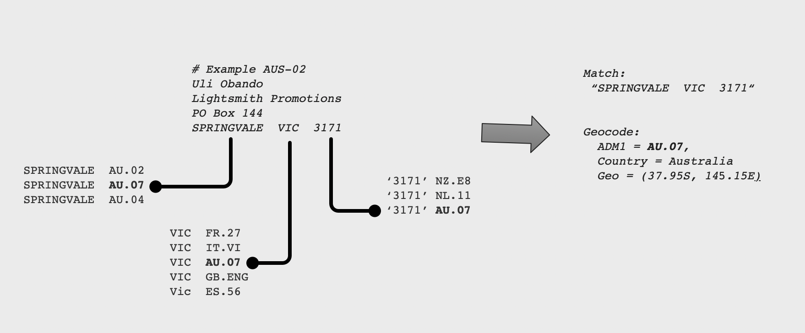

# Postal Geocoder

Let's take a moment to look at the area of postal addresses. There are several address parsers -- however
there are not many address detectors.  How can you detect a postal address in free text?  Sure look 
for "Street", "Apt", or "PO Box".  That may work for English language scenarios, but does not parse well. 
The one thing concrete addresses have is some well-formed postal code.  Using a postal code as an anchor
we can branch out and see if there is any valid geographic names, abbreviations and/or codes to qualify
that postal code.   This seems pretty safe -- we are not likely to encounter a valid postal code in a valid 
address block and not be able to resolve other geography nearby.    If we can't, well, there is little value
to a postal code found in the middle of text if it has no other amplifying context.

A few examples borrowed from Wikipedia (https://en.wikipedia.org/wiki/Address#Australia accessed in 2021): 

```
    # Example AUS-01
    Finance and Accounting
    Australia Post
    219–241 Cleveland St
    STRAWBERRY HILLS  NSW  1427
    
    # Example AUS-02
    Uli Obando
    Lightsmith Promotions
    PO Box 215
    SPRINGVALE  VIC  3171
```

These have the `BLOCK` form where the address is listed one line of text for ADDRESSEE, STREET#1, STREET#2, CITY_PROV_POSTAL 
tuple.  Additionally the country name or code may appear as a final line, certainly for international addresses.  Toss
in related contact information (building #, email address, phone number) and now you have a nice alphanumeric soup!  
You might encounter postal addresses in-line, across lines, in tables, and in other scenarios amongst other text.

Figure 1. Postal Address Geotagging and Geocoding Concept illustrates the core matching concept -- where `AUS-02` example
above is tagged finding city `SPRINGVALE`, a name `VIC` and a postal code `3171`. On its face, this situation is 
just a sequence of geotags, possibly all unrelated. There is no assumption about the feature types or the traits of 
the places mentioned. 



The connection between the geotags that form an address is that they share some administrative boundary.  For large
countries, we might have to go to Level 2 or Level 3 administrative boundaries to be sure we get the right location/postal
association.  But the general case of using Level 1 (`ADM1`) associations covers most geographies.  In figure 1, 
The geotags `SPRINGVALE`, `VIC` and `3171` each appear in many countries and only until we lock in this `ADM1` association
do we start to see which location this tuple might represent.   So there the answer key is `ADM1 = AU.07 (Victoria)` is the 
common boundary that contains the address.

Now consider if you only had `....VIC 3171 .... `  or `...SPRINGVALE, VIC...`, do these in isolation represent solid
postal address mentions?  Not quite.  

## Tagger/Coder Implementation

The Xponents `PlaceGeocoder` is complex enough, we're not expanding that with postal capabilities outright. 
Adding a simple `PostalGeocoder` to handle detection of postal metadata is the current approach here in v3.x:  
it keeps the memory profile low, provides some solid value, and keeps complexity down.   The `PostalGeocoder`
can be used apart from the heavier weight `PlaceGeocoder`.  The `XlayerServer` offers the ability to run 
these together to detect and geolocate addresses to the city level. 

The `PostalGeocoder.extract(text)` detects valid Postal + Admin pairings of the of the forms:

```
   ADM1 POSTAL
   POSTAL ADM1
   POSTAL COUNTRY
   COUNTRY POSTAL
```

So in the examples above the tagger emits valid first-pass geolocation for `VIC 3171`, identifying it as a candidate 
coded for boundary `AU.07`.

The combination of tagging for places, tagging for postal codes and then stitching the two together 
is the most effective solution for working with arbitrary unstructured content.   There is little benefit from 
making a perfect, single geocoder that operates on natural language --- the use cases where such address data appears
is not always well-formed or natural. 


Finally, you may ask what is next?  What about the street 
address, the apartment number and PO Box?  For that, solutions
such as `Geopy`, `Pelias.io`, `Google Geocoder`, `Nominatum`, etc.
all exist to help you explore the actual street address geolocation
.... Here we just helped you find it in the first place.  Yes, 
parsing backwards (or forwards) to identify the start of the street name and number
is an exercise for you the end user.  There are resources that offer
by-country patterns for common addresses.


## Client API Usage

TBD

